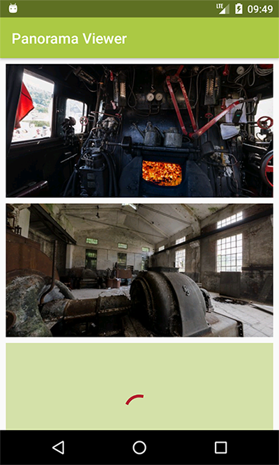
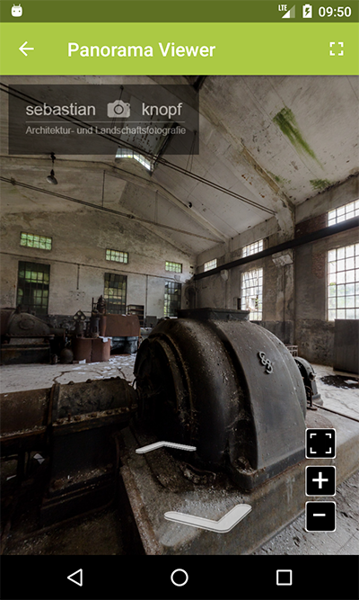

# GardenGnomeViewer
GardenGnomeViewer is a simple offline viewer app for displaying GGPKG panorama files generated by Pano2VR on Android devices.

Typical use scenarios are the use as showcase for photographers or on exhibitions to display your greatest panorama experiences!

 

*Note:* This is not a official project from [GardenGnome Software](https://www.ggnome.com)!

## Changelog
* Version 1.0.0:    Basic version for offline-viewing GGPKG files
* Version 1.0.1:    - bug fixes
                    - optimization of behaviour on orientation change
                    - nicer launcher icon and logos
                    - ability to open ViewerActivity via content uri
* Version 1.0.2:    - added permission for accessing internet
                    - improved behaviour of ViewerActivity on singleTask instances
                    - implemented CacheCleanerTask to clean up any temporary files 
* Version 1.1.0:    - introduced SettingsActivity and SettingsManager                  

## System Requirements
* Android >= API 21
* Valid GGPKG files generated by Pano2VR >= 5
* AndroidX Support (for development only)
* Android DataBinding (for development only)

## Contributing / Build
If you want to build your own version of this app, simply clone this repository and build it with Android Studio.
For testing purposes you can use the sample file in [examples directory](examples/). *Note: These files are only for use to test
this software. Any other use - especially commercial use - is strictly prohibited!*

If you want to contribute this project, I'm glad to hear from you! The only thing you should do before coding
is to take a look into the latest enhancements and take a short look over the source code. Your code should fit into
the existing code, to keep the project clean and easy to maintain. If you've any questions left, you can
contact me via my profile or write an email to [mail@sebastian-knopf.de](mailto:mail@sebastian-knopf.de).

## License
This project is licensed under the Apache 2.0 license. See [LICENSE.md](LICENSE.md) for more information.
